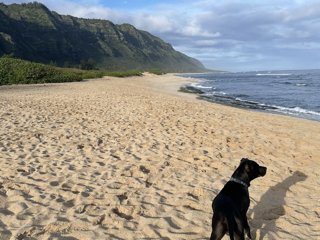

# cpenny-portfolio
Personal Portfolio of Chad Penny for CMU Class 94870 Telling Stories with Data

# About Me
Hello, I am part of the Army MISM-BIDA Cohort. I am in my third semester at Heinz. My hobbies are working out and watching football and other sports. I am from South Jersey and was lucky enough to be able to spend a lot of time home at the beach with my family and friends this summer. I have a dog named Shark who I love very much. Below is a photo of my beloved Shark on the North Shore of Oahu near Kaena Point. I used to drive around the North Shore with Shark with my windows down in my truck, until one time he jumped out on a major road. I left the car running and chased after him for about a mile but ended up losing him on some farm land. The local farmer helped me look around the property but we couldn't find him. Once we parted ways, he called me and said he found him in his bedroom. That was the last time Shark got to drive around with the windows down. 

# What I hope to learn
Visualization in general is one of my weaknesses. In my internship, I did a lot of data visualization in Tableau, including overlaying specific seats on a map of Acrisure Stadium and comparing several different revenue streams. I had a lot of practice with it in my internship and improved, but I still have a long way to go and I hope this class will get me there! I look forward to improving Tableau skills and learning other visualization techniques! 

# Portfolio 
This is where I will put the new things I do.  
Here is a tableau viz, what do you think?
[Tableau_Viz](tableau1.md)

# Assignment: [Visualizing Overnight Debt](dataviz3.md)

# Assignment3&4: [Critique by Design](assignment3_4.md)
Click the link above to check it out!
 
# Final Project (In Progress)
- [Part I](finalProject_part1.md)
 
- [Part II](Part_II.md)
- [Part III](Part_III.md)
