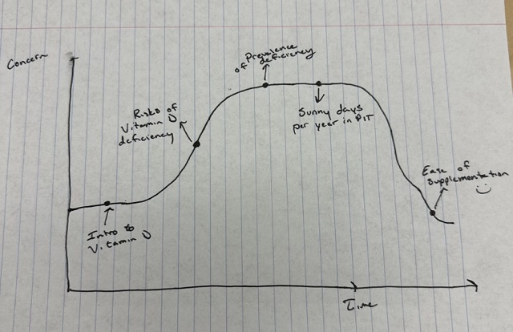
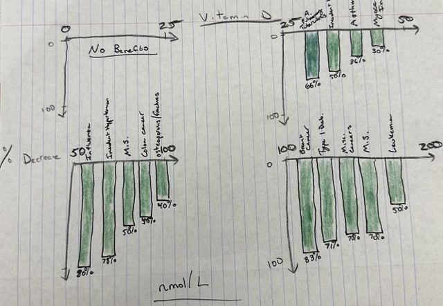
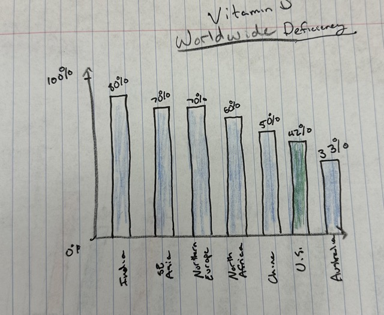
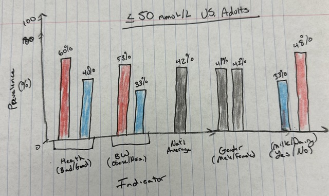

# No one should be deficient in Vitamin D. 
The point of my project is to use the data to inform people that there is no reason to be deficient in Vitamin D. Vitamin D has a multitude of known and studied benefits, however deficiency is very common. Getting enough Vitamin D is an easy action everyone can take to contribute towards a healthy lifestyle. 

### Story Arc
The story I want to tell begins with a brief introduction to Vitamin D for those unfamiliar with it. Next, it moves into the risks of a Vitamin D deficiency (and benefits of sufficient levels of Vitamin D). Here, the audience will feel slightly concerned about their Vitamin D levels. Next, the story moves into the prevalence of Vitamin D deficiencies worldwide and among U.S. Adults. From there, the story will present the additional risk due to the lack of sunshine in Pittsburgh relative to other cities. Finally, the story will end on a high note and alleviate concerns by highlighting how easy it is to get sufficient Vitamin D and why no one should be deficient in it. Vitamin D deficiency is a serious public health risk, it is extremely prevalent, and its so easy and beneficial to get sufficient Vitamin D. 

### Outline (each discussed in detail below)
#### 1) Intro To Vitamin D - what is it
#### 2) Risks of Vitamin D Deficiency - why do we need it, what bad happens if we don't have enough, what good happens when we get enough
#### 3) Prevalence of Deficiency (Worldwide and U.S.) - deficiency is very prevalent!
#### 4) Sunny days per year in Pittsburgh - Pittsburgh lacks sunshine
#### 5) Ease of Supplementation - getting enough Vitamin D is easy!

### Intro to Vitamin D 
Vitamin D, also known as the "sunshine vitamin," is a fat-soluble vitamin essential for various bodily functions. It plays a crucial role in calcium absorption, promoting strong and healthy bones. While the primary source of vitamin D is sunlight exposure, it can also be obtained from dietary sources and supplements, making it vital for overall health and preventing conditions osteoporosis and influenza.
This part does not have any specific data visualizations, but will include highlighting key statistics, such as Vitamin D contributes to at least XX healthy bodily functions to include digestion, bone health, immune response, etc.

### Risks of Vitamin D Deficiency 
(I plan on doing these as a series of graphs and including more conditions/diseases on each.)
Here I decided to flip the traditional y-axis of the graphs to drive home that these levels are decreases of the risk of getting these diseases/conditions. After getting feedback from my peers,this was not abundantly clear to them. Additionally, the scales of Vitamin D levels I used is somewhat misleading since they are different thresholds. I still plan on doing a series of charts, but I will need to rework how these graphs are constructed. I may consolidate them into just two graphs, a graph showing the risks of being deficient, and a graph showing the benefits of having sufficient levels. I will also need to make it clear that these are not necessarily causation.

 
(Data Source: [Source](https://vitamindwiki.com/Chart+of+Vitamin+D+levels+vs+disease+-+Grassroots+Health+June+2013))
(Individual Data sources from vitamindwiki reference include A. Cohort-based, B. Case-control, R. Randomized controlled trial, U. Ultraviolet B-based study
Gorham E, et al. 2011 October 19. [Submitted for Publication]; Munger KL, et al. JAMA 2006 296:2832-8; Giovannucci E, et al. Arch Intern Med.
2008 Jun 9 168(11):1174-80; Gupta A, et al. Am J Respir Crit Care Mod 2011 Sep 15. (Epub ahcad of print]; Lowe LC, et al. Eur J Cancer. 2005 May 41(8):1164-9; Davies PD. et al. Thorax. 1985 Mar 40(3): 187-90; Bischoff-Ferrari HA, et al. JAMA. 2005 May 11 293(18):2257-64; Burgi AA, et al. J Bone Miner Res. 2011 Oct 26(10):2371-7; Robinson C, ct al. Am J Obstet Gynecol. 2011 Jun;204(6):556.c1-4; Robinson C, et al. Am J Obstet
Gynecol, 2010 Oct:203(4):366.el-6; Cannell JJ, et al. Epidemiol Infect. 2006 Dec 134(6):1129-40; Forman JP, et al. Hypertension. 2007 May 49(5):
1063-9.; Holick MEF, Drugs Aging. 2007 24(12):1017-29; Lappe JM. ct al. Am J Clin Nutr. 2007 Jun 85(6):1586-91; Gorham ED, et al. Am J Prev Med.
2007 Mar 32(3):210-6; Mohr S, et al. Am J Prev Med. 2010 Mar 38(3):296-302; Mohr SB, et al. Am J Prev Med. 2011 Jul 41(1):68-74; Mohr SB, et al.
Pancreas. 2010 Jul 39(5):669-74; Mohr S, et al. Int J Cancer. 2006 Dec 1 119(11):2705-9; Mohr SB, et al. Prev Med. 2007 Nov 45(5):327-31;)

### Prevalence of Viamin D Deficiency 
The point of this graph is to show the prevalence of Vitamin D deficiencies. While many other countries have signficantly higher levels than the United States, I want to make the point that 42% is still very high. I plan on including more countries that have less than the United States so I can center the United States on the X-axis and draw attention to it. On Shorthand, I may prelude this graph with a statistic such as "4 in 10 adults in the United States are Vitamin D deficient". 
 
I am considering changing this last graph to a by latitude as is presented in Source 3 below. This way, I can do the graph on a world map and show where Pittsburgh is with a marker. 
 

 

 
After getting feedback on this next graph, I realized I will need to reconstruct this graph as well. One of my peers pointed out that it makes it look like causation, such as bodyweight causes low vitamin D or vice versa. That is not my intention of this graph, I simply want to point out that statistically certain populations are more at risk of deficiency, likely due to lifestyle. Again, this is correlation. A person will not be able to go from unhealthy to healthy overnight by taking Vitamin D, but getting sufficient Vitamin D is an easy step anyone can make to improve their health.
[Source 1](https://www.sciencedirect.com/science/article/pii/S0271531710002599?via%3Dihub)
[Source 2](https://www.onmarket.com.au/about-us/blog/why-is-vitamin-d-so-important/)
[Source 3](https://www.frontiersin.org/articles/10.3389/fnut.2023.1070808/full#B24)

### Sunny days per year in Pittsburgh
#### More than 90% of the vitamin D requirement for most people comes from casual exposure to sunlight 
[Source 1](https://www.sciencedirect.com/science/article/pii/S0002916522037674?via%3Dihub)
 
(**Plot not final version, need to fix labels, just for proof of concept**) 
The point of this graph is to show that living in Pittsburgh puts people here at higher risk of Vitamin D deficiency just because of less sunlight. I also want to find a way to make the point that diet/supplementation are more important in the winter.

### But it's so easy to get enough...

#### 1) Sunlight "Under the right circumstances, 10 to 15 minutes of sun on the arms and legs a few times a week can generate nearly all the vitamin D we need" Source: https://www.health.harvard.edu/staying-healthy/time-for-more-vitamin-d
#### 2) Vitamin D Rich Foods: Fish, Dairy, Eggs (Here I need to rank foods by how much Vitamin D they have so they are better informed)
#### 3) Supplement. Very affordable (Perhaps a screenshot of Vitamin D on Amazon or at the grocery store).

## Method and Medium
I plan on using shorthand with visualizations from a variety of places such as flourish and tableau. I plan on first finishing all of my visualizations in order of how they will be presented on Shorthand and then moving to shorthand and making them flow. At this point, I probably have identified more data than I will actually use, so I will need to pick and choose the final data that will be presented.

### Data

For Risks of Vitamin D Deficiencies/Benefits of Adequate Levels I will use a variety of sources including mostly scientific journals: (https://vitamindwiki.com/Chart+of+Vitamin+D+levels+vs+disease+-+Grassroots+Health+June+2013)). This chart is a consolation of several 
studies on Vitamin D. I will need to cite each individual study.
 
For prevalence of Vitamin D deficiencies in the United States I will use: https://www.sciencedirect.com/science/article/pii/S0271531710002599?via%3Dihub
 
For prevalence of Vitamin D deficiencies in the world I will use: NCB Prevalence and correlates of vitamin D deficiency in US adults. International Osteoporosis Foundation: Vitamin D Status in Europe. China: Wolters-Kluwer journal Medicine Lips P. Worldwide status of vitamin D nutrition. I Steroid Biochem Mol Biol. 2010; 121:297-300. Holick MF. Vitamin D: importance in the prevention of cancers, type 1 diabetes, heart
disease, and osteoporosis. Am J Clin Nutr. 2004; 79:362-71. These sources are consolidated on https://www.onmarket.com.au/about-us/blog/why-is-vitamin-d-so-important/.
 
For Sunny Days in Pittsburgh, I will use https://www.sciencedirect.com/science/article/pii/S0002916522037674?via%3Dihub.
 
At this point, I may end up using more data than is currently reflected in the excel sheet. 

